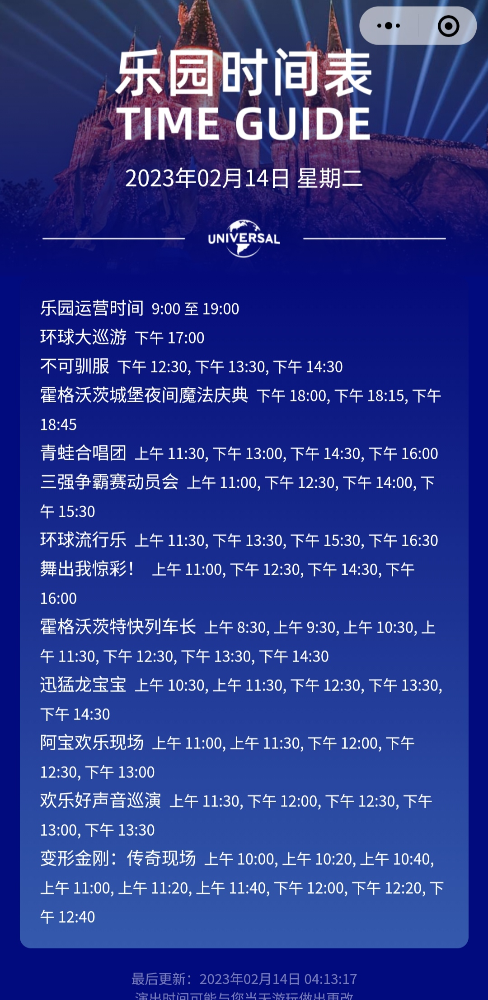

# 项目分布

| 主题 | 项目(等候时间min~max) | 演出(time, len) |
| :--- | :--- | :--- |
| 全局 | | 环球大巡游(17:00, 40) 注：内环，好莱坞-侏罗纪-小黄人
| 小黄人 | 萌转过山车(20~45) 神偷奶爸小黄人闹翻天(10~40) 超萌漩漩涡(5~20) | 欢乐好声音巡演(11:30/12:00/12:30/13:00/13:30) 小黄人见面会 |
| 哈利波特 | 哈利·波特与禁忌之旅(20~50) 奥利凡德(15~35) 鹰马飞行(10~35) | 霍格沃茨城堡夜间灯光庆典(18:00/18:15/18:45, 6) 青蛙合唱团(11:30/13:00/14:30/16:00) 三强争霸赛动员会(11:00/12:30/14:00/15:30) 霍格沃茨特快列车长(8/9/10/11/12/13/14:30) |
| 侏罗纪 | 飞越侏罗纪(30~60) 侏罗纪世界大冒险(25~50) 奇遇迅猛龙(10~30) 侏罗纪营地 | 迅猛龙宝宝(10/11/12/13/14:30) |
| 功夫熊猫 | 灯影传奇(5~25) 炫转武侠(5~15) 功夫熊猫：神龙大侠之旅(5~10) 功夫游戏 阿宝功夫训练营 | 阿宝欢乐现场(11:00/11:30/12:00/12:30/13:00) 功夫熊猫见面会 智慧仙桃树  |
| 变形金刚 | 变形金刚：火种源争夺战(30~50) 大黄蜂回旋机(10~30) 霸天虎过山车(10~30) | 变形金刚：传奇现场(10/11/12:00/20/40) |
| 好莱坞 | 灯光，摄像，开拍！(5~10) | 不可驯服(12/13/14:30, 20) 环球流行乐(11/13/15/16:30) 舞出我惊彩！(11:00/12:30/14:30/16:00) 环球新春许愿树 好莱坞见面会 |

## 客流分析
- 根据“乐园等候时间”小程序预报，周三预估客流2.0W

| 01/07 2.1W客流（时间基线） | 02/05 2.4W客流（时间上限） |
| :----------: | :----------: |
|  |  |

## 时间表（参考02/14）

